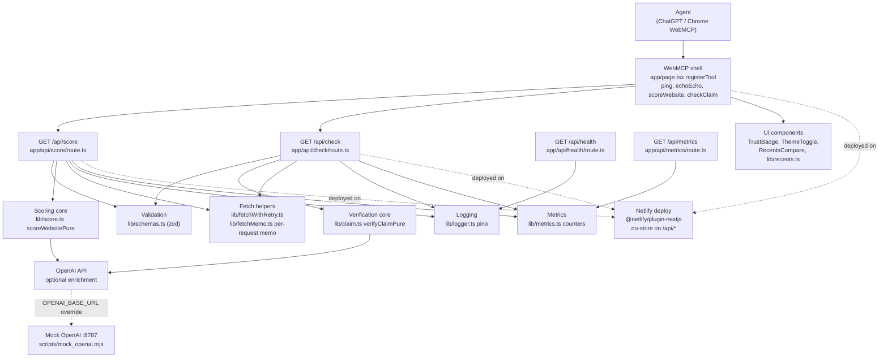
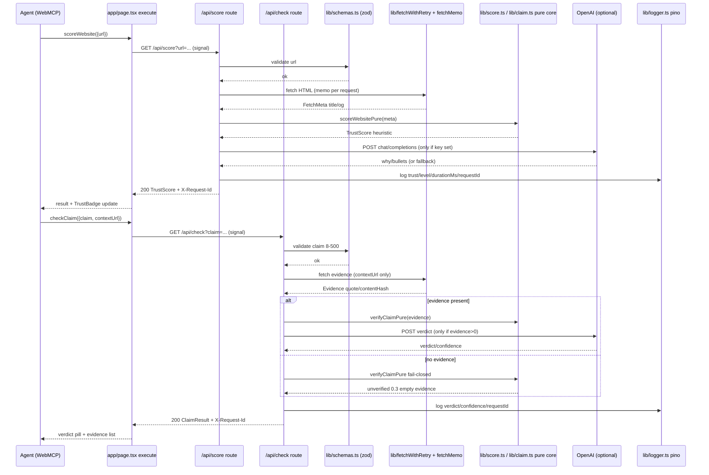
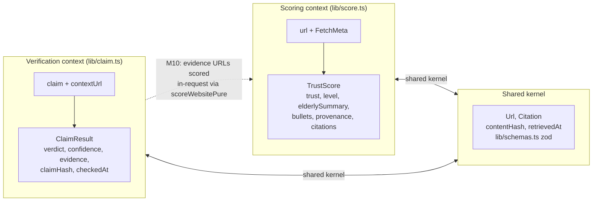
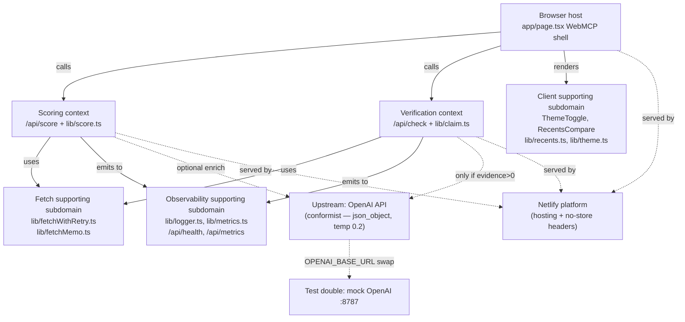
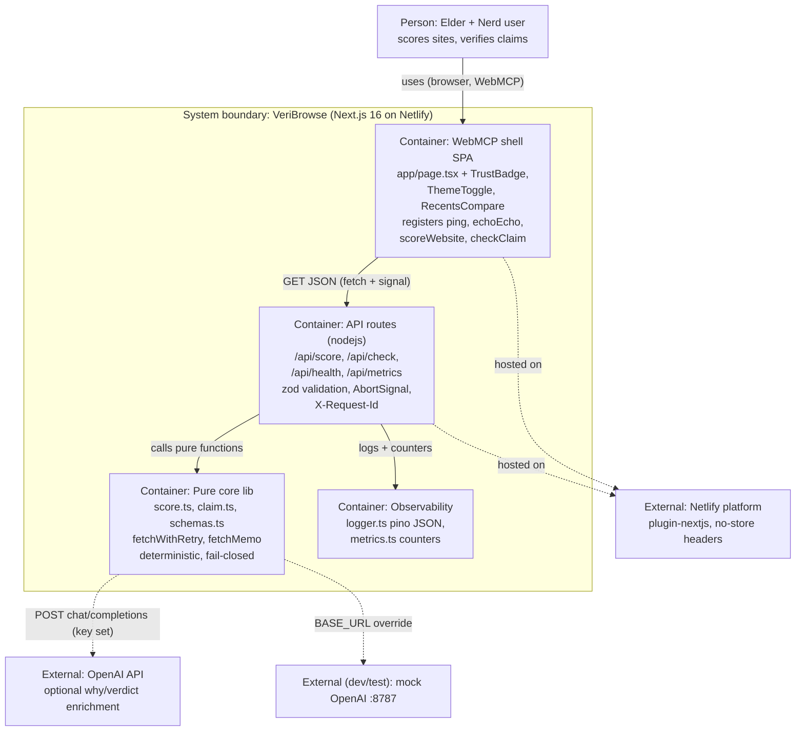

# VeriBrowse Architecture — DDD + FCIS + DDIA

## Bounded contexts

- **Scoring** (`lib/score.ts`): `url → FetchMeta → TrustScore` — heuristic + LLM why.
- **Verification** (`lib/claim.ts`): `claim + contextUrl → Evidence → ClaimResult` — fail-closed.

Shared kernel: `Url`, `Citation {url, snippet, contentHash, retrievedAt}`.

## File mapping to monolith families

- **pp:** tracer `ping`/`echoEcho` before `scoreWebsite`/`checkClaim`; `mise run qa` executable spec; DRY zod in `lib/schemas.ts`.
- **aposd:** `lib/score.ts` is deep module — one place owns heuristics, summary, provenance. `app/page.tsx` registerTool is thin.
- **fcis:** `execute` parses with zod, delegates to pure `scoreWebsitePure` / `verifyClaimPure`. No hidden IO in core.
- **ddia:** fetch with `AbortSignal`, timeouts, provenance `contentHash` + `retrievedAt`; unknown claim → `unverified` empty evidence (never hallucinated).
- **ddd:** two contexts, no anemic `utils` cross-contamination.
- **aiswe:** AI scaffolds routes/tests, human verifies `registerTool` on both browsers and prompt PII handling.

## Data flow

```
browser registerTool
  -> Node.js runtime GET /api/score?url=... (zod) -> fetch HTML -> meta -> buildTrustScore -> log json -> json response
  -> Node.js runtime GET /api/check?claim=... -> fetch evidence? -> verifyClaimPure -> log -> json
```

All logs via `pino` with `requestId`, `contentHash`, PII redacted.

## Observability & Resilience

- **Logging:** `lib/logger.ts` pino JSON with `service: veribrowse`, `level` from `LOG_LEVEL` (default `info`), `requestId` via `withRequestId(id)` child logger, `durationMs` bounded >0, `hasKey` boolean, `trust/level` or `verdict`. Redact `OPENAI_API_KEY`, `authorization` — never logs `sk-` (`redact: ["OPENAI_API_KEY","authorization"]`).
- **Request correlation:** Every `app/api/*` route reads `X-Request-Id` (case-insensitive) and echoes it; if absent generates `crypto.randomUUID().slice(0,8)`. Header set on 200 and 4xx/499. Logs include `requestId` mirroring header. Use `curl -D - -H "X-Request-Id: my-id" http://127.0.0.1:3000/api/health` to correlate.
- **Tracing stub:** `traceparent` (W3C `00-<trace>-<parent>-01`) passthrough stub — server accepts header without error, optionally logs `traceparent` field, preserves `X-Request-Id`. No OTel SDK by default; comment in `lib/logger.ts` and `docs/runbook.md` documents future `@opentelemetry/sdk-node` wiring when `OTEL_EXPORTER_OTLP_ENDPOINT` is set. See `docs/runbook.md#tracing-stub`.
- **Metrics:** `lib/metrics.ts` in-memory counters `score_requests_total`, `check_requests_total`, `openai_fallback_total`, `http_requests_total` (`inc()` per request/fallback, `toPrometheus()` HELP/TYPE exposition). Exposed at `GET /api/metrics` as `text/plain; version=0.0.4` Prometheus format, no auth, includes `X-Request-Id`. Counters reset on restart (stateless Netlify).
- **Fetch resilience:** `lib/fetchWithRetry.ts` wraps HTML and `POST {OPENAI_BASE_URL}/v1/chat/completions` with `AbortSignal.timeout(3000)` per attempt, 2 retries exponential (100ms * 2^attempt), in-memory breaker 30s open per host (`breaker.set(host, Date.now()+30_000)`), `AbortError` not retried, signal propagation via `AbortSignal.any` / fallback.
- **Health & metrics endpoints:** `GET /api/health` → `{status:"ok",service:"veribrowse",version:"0.1.0"}` + `X-Request-Id` + `cache-control: no-store`; `?verbose=1` adds `uptime` + `timestamp`. `GET /api/metrics` → Prometheus text. Both stateless, no auth.
- **Alerting:** Primary signal is Netlify deploy/function logs (`level:error` search); optional external uptime check `curl /api/health` via UptimeRobot/Checkly every 5m. No Prometheus/Grafana required. See `docs/runbook.md#alerting--uptime`.

## Version pins (refreshed 2026-09-04)

Single source of truth is `mise.toml` + `package.json`; `scripts/check_version_drift.sh`
gates Node alignment across `mise.toml`, both `netlify.toml` files, `ci.yml`, and
`package.json` engines. Documented floors only — never enforce `min_version`
(Netlify build image carries an older mise and hard-fails on any floor).

- Runtime: Node `22.23.2`, pnpm `9.15.9`, Pitchfork `2.23.0`
- Framework: Next.js `16.3.4` (App Router, `nodejs` runtime), React `19.2.8`, Tailwind CSS v4 (`4.3.3` via `@tailwindcss/postcss`)
- Core deps: `zod 4.x` (`4.5.4`), `pino 10.x` (`10.3.1`), `openai 7.x` (`7.10.0`)
- Toolchain: TypeScript `5.9.3` strict, vitest `5.0.0`, eslint `9.39.5`, jsdom `30`
- Deploy: `netlify.toml` `NODE_VERSION 22.23.2`, `@netlify/plugin-nextjs` runtime, `cache-control: no-store` on `/api/*`

## Diagrams (mermaid — GitHub renders natively)

### 1. High-level architecture (beta)



### 2. Request sequence (score + check)



### 3. Bounded contexts



### 4. Context map (contexts + supporting subdomains)



### 5. C4 container diagram


